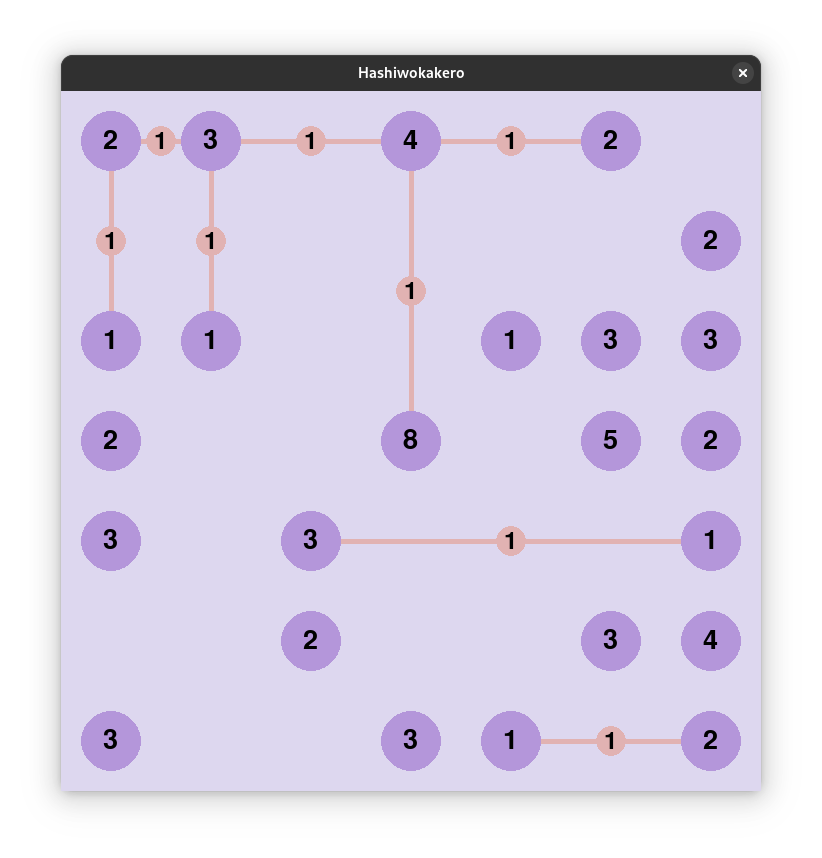

# 🎮️ Hashiwokakero
El juego Hashiwokakero es un juego de lógica usando una grilla de n x n celdas. En algunas de las celdas números usualmente encerrados en un círculo con los númeos del 1 al 8 a los que se denominan islas y las demás celdas comienzan vacías. El jugador debe conectar mediante puentes las islas formando un componente conectado con todas las islas teniendo en cuenta las siguientes reglas:

* Cada isla debe estar conectada con el número de puentes que indica el número que la define
* Los puentes solo pueden ser horizontales o verticales. Los puentes no pueden ir en diagonal y no se pueden cruzar por encima de otro puente.
* Se pueden crear máximo 2 puentes entre 2 islas.



## 🤖 Modo Automático
El tablero puede ser resuelto automáticamente mediante el uso de _heurísticas_ predefinidas, para jugar de manera autónoma utilize el parámetro `-a` o `--automatic` y observe en consola qué heurísticas están siendo utilizadas

## 📑 Instrucciones
Instalar las dependencias definidias en [requirements.txt](./requirements.txt) utilizando el comando
```sh
pip install -r requirements.txt`
```
Correr el script ubicado en *src/main.py* con los siguientes argumentos:

	-f <input file> o --file <input file>

Donde el argumento _file_ indica el tablero de entrada, archivos de entrada de ejemplo pueden encontrarse en el directorio [`./test`](test/game_1.board)


### Ejemplo:
```sh
python3 ./src/main.py -f ./test/game_1.board
```

## 👷 Integrantes
* Juan Esteban Urquijo
* Ángel David Talero